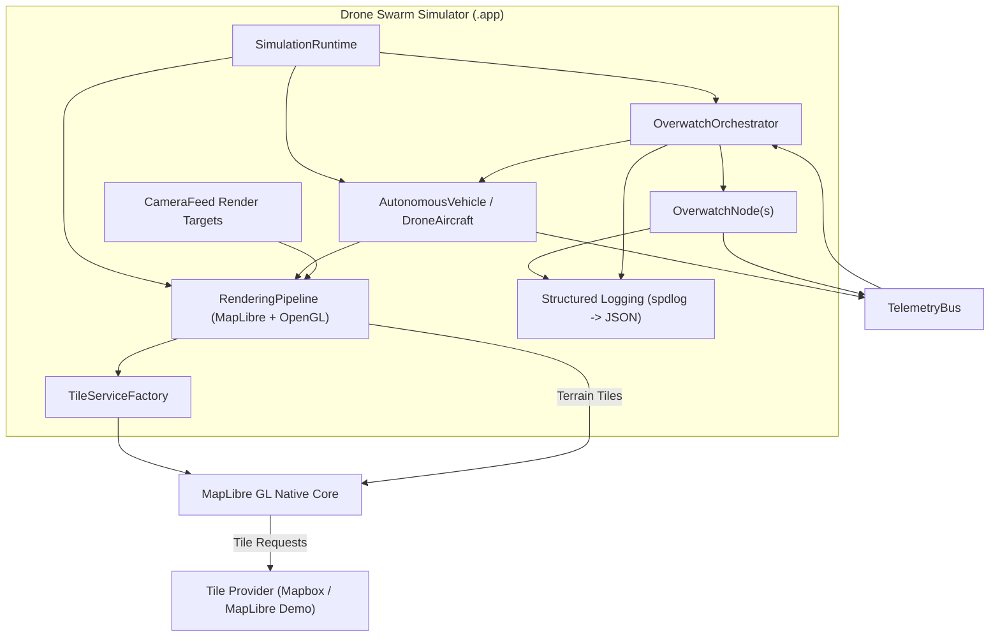
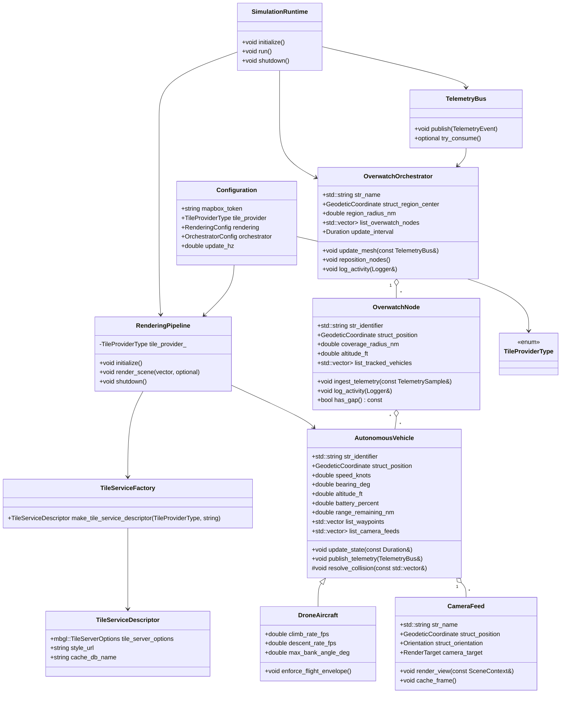
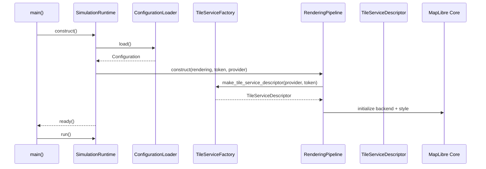
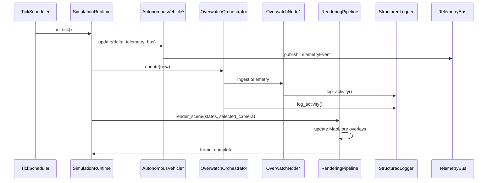

# Drone Swarm Simulator

A macOS-native (Apple Silicon) simulation of autonomous drones collaborating in open-world 3D space, rendered with MapLibre GL Native and a GLFW/OpenGL presentation layer.

## Project Vision

- Real-time visualization of drone swarms, overwatch nodes, and Earth regions using MapLibre GL Native (OpenGL backend) with Mapbox tiles via the provided token.
- Default operational theatre initialises around San Diego with a 50-mile radius overlay for immediate situational awareness.
- Autonomous vehicle models that track range, kinematics, battery, waypoints, sensor payloads, and camera feeds while coordinating to avoid collisions.
- Adaptive overwatch mesh that preserves coverage across large regions, repositions to heal gaps, and logs orchestration activity.
- Production-grade tooling: C++23 core, CMake/Ninja builds, strict warnings-as-errors, sanitizers in CI, and notarized `.app` + `.dmg` packaging.

## Key Technical Decisions

- **Language & Toolchain:** C++23, clang 17+, CMake 3.26+, Ninja generator, strict warning sets. Native MapLibre GL rendering via GLFW/OpenGL with Mapbox vector tiles.
- **Mapping & Terrain:** MapLibre GL Native (OpenGL backend) consuming Mapbox vector/satellite tiles with token `pk.eyJ1IjoiZGF2ZWN0aG9tYXMiLCJhIjoiY21oNTRiZGlvMDNtdDJxcHVybThhdThzdyJ9.Aasm_2F-kEVsiXaSEFmLxw`.
- **Simulation Loop:** Fixed update cadence of 1 Hz by default (configurable per orchestrator) with interpolation for smooth rendering.
- **Physics & Autonomy:** Direct-course navigation with collision avoidance, energy consumption modeling, and configurable mission profiles.
- **Camera Feeds:** On-demand picture-in-picture render targets for the selected drone; other feeds remain cached locally.
- **Telemetry & Logging:** Structured JSON logs for both overwatch nodes and the orchestrator, persisted per region with rotation.
- **Packaging:** Signed and notarized `.app` bundle distributed in a `.dmg`, plus optional Homebrew tap scripts for automation.

## Core Components

1. **AutonomousVehicle** – Base agent abstraction with state for geodetic position, altitude, bearing, speed, remaining range, battery, payload metadata, mission waypoints, sensor suite, and camera feeds.
2. **DroneAircraft** – Airborne specialisation adding flight envelope constraints, climb/descent rates, wind drift compensation, and airspace compliance rules.
3. **CameraFeed** – Manages gimbal orientation, simulated video render targets, and caching of inactive feeds.
4. **EarthRegion** – Represents the active theatre, manages map boxes, altitude reference, and provides rendering hooks into MapLibre.
5. **OverwatchNode** – Fixed observer with spherical coverage, subscription to telemetry bus, activity logging, and gap detection heuristics.
6. **OverwatchOrchestrator** – Places/repositions overwatch nodes to maintain mesh coverage, drives update cadence, and aggregates logs.
7. **RenderingPipeline** – Coordinates MapLibre terrain, overlays drone states, and manages the GLFW/OpenGL presentation loop.
8. **SimulationRuntime** – Main entry point wiring configuration, EarthRegion, orchestrator, vehicles, rendering loop, and graceful shutdown.

## Implementation Roadmap

1. **Foundations**
   - Scaffold CMake project, configure clang settings, integrate clang-format/clang-tidy/sanitizers.
   - Vendor MapLibre GL Native, GLFW, glm, spdlog, nlohmann/json, and fmt via CPM.cmake or vcpkg manifest.
   - Establish logging, configuration parsing, and unit test harness (Catch2 + CTest).
2. **World & Rendering**
   - Implement EarthRegion, map tiling, and MapLibre renderer integration.
   - Build RenderingPipeline with MapLibre + GLFW/OpenGL overlays for drones and overwatch nodes.
3. **Vehicle & Autonomy**
   - Define AutonomousVehicle, DroneAircraft, CameraFeed models with kinematics, battery usage, and collision avoidance.
   - Add update loop with configurable cadence and telemetry publication.
4. **Overwatch Mesh**
   - Implement OverwatchNode monitoring, coverage calculations, and structured logging.
   - Build OverwatchOrchestrator with mesh planning, gap detection, and repositioning strategy.
5. **User Interface & Camera Views**
   - Add selection UI, PIP camera rendering, mission controls, and telemetry dashboards.
6. **Packaging & Distribution**
   - Produce signed/notarized `.app`, wrap in `.dmg`, finalize documentation, and optional Homebrew tap formula.

## Build & Run Guide

### Prerequisites

- macOS 15.6.1+ on Apple Silicon with Xcode Command Line Tools (`xcode-select --install`).
- CMake ≥ 3.26 and Ninja (recommended: `brew install cmake ninja`).
- A Mapbox access token; the repository ships a development token in `config/env_template.txt`, but override it for production runs.

### Build Pipeline Overview

```mermaid
flowchart LR
    A[Source Checkout] --> B[CMake Configure<br/>make -S . -B build -G Ninja]
    B --> C[FetchContent Vendors<br/>(spdlog, GLFW, MapLibre, Catch2, ...)]
    C --> D[Generate compile_commands.json]
    D --> E[Build Targets<br/>cmake --build build]
    E --> F[Executables & Libraries<br/>(drone_swarm_app, drone_swarm_lib)]
    E --> G[Unit Tests<br/>cmake --build build --target drone_swarm_tests]
    G --> H[CTest Execution<br/>ctest --output-on-failure]
```

### Environment Setup

1. Copy the template and customize it:

   ```bash
   cp config/env_template.txt .env
   ```

   Keep the keys in `.env` aligned with `config/env_template.txt`; VS Code’s debugger reads this file via `.vscode/launch.json`, so new variables should be added to both places.

2. Edit `.env` and supply your Mapbox token (replace the placeholder when the bundled development token is insufficient) plus any overrides you need.

3. When running from a shell outside VS Code, load the variables before launching:

   ```bash
   source .env
   # or: export $(grep -v '^#' .env | xargs)
   ```

VS Code automatically injects the `.env` values during debug sessions; command-line runs require you to export them manually.

### Configure

```bash
cmake -S . -B build -G Ninja -DCMAKE_BUILD_TYPE=Debug
```

- Swap `Debug` for `Release` when you need an optimised build.
- Additional options:
  - `-DDRONE_SWARM_BUILD_TESTS=OFF` to skip unit tests.
  - `-S` and `-B` can be changed if you prefer a different build directory.

The configure step also generates `build/compile_commands.json` for IntelliSense and clang tooling.

### Build

```bash
cmake --build build --target drone_swarm_app --parallel
```

Useful variants:

- `cmake --build build` to build every target (library, app, tests).
- `cmake --build build --target clean` to clean artefacts.

### Run

```bash
./build/apps/simulator/drone_swarm_app
```

Runtime options leverage environment variables with sensible fallbacks:

- `DRONE_SIM_UPDATE_HZ` (default: `1`) – simulation tick rate.
- `DRONE_SIM_LOG_DIR` (default: `logs`) – structured log directory.
- `DRONE_SIM_REGION_RADIUS_M` (default: `5000`) – operational radius in metres.
- `DRONE_SIM_OVERWATCH_HEIGHT_M` and `DRONE_SIM_OVERWATCH_COVERAGE_M` to tune overwatch behaviour.
- `DRONE_SIM_TILE_PROVIDER` (default: `mapbox`) – select `mapbox` for Mapbox Raster Tiles or `maplibre_demo` for the public MapLibre demo style.

Camera feeds render on demand when a drone is selected in the UI; other feeds remain cached.

### Mapping SDK Notes

- The project vendors [MapLibre Native](https://maplibre.org/projects/maplibre-native/) via CMake’s `FetchContent`. The initial configure step downloads sources and dependencies (~400 MB); ensure network access is available.
- MapLibre is licensed under the BSD 2-Clause license. Comply with both MapLibre licensing and any tile provider terms.
- MapLibre handles scene graph management, camera control, style parsing, and GPU rendering. Tile services supply the actual map data (vector tiles, raster imagery, terrain). We default to Mapbox’s Raster Tiles API via the `mapbox://styles/mapbox/satellite-streets-v12` style, which overlays vector labels on satellite imagery.
- Because the default style hits Mapbox infrastructure, a `MAPBOX_ACCESS_TOKEN` must be available when `DRONE_SIM_TILE_PROVIDER=mapbox`. Set `DRONE_SIM_TILE_PROVIDER=maplibre_demo` to run against MapLibre’s public demo tiles (no token required) or wire in your own style URL.
- Replacing Mapbox is straightforward: supply a different style URL (e.g., Mapbox Studio variants, MapTiler, MapLibre Atlas, or self-hosted tiles) and the corresponding authentication environment variables (`MAPBOX_API_BASE_URL`, vendor-specific tokens, etc.).
- Tile caches are stored in `${DRONE_SIM_LOG_DIR}/map_cache/`. Purge this directory if you need to reclaim disk space or rotate credentials.

## Core Object Overview

| Component                             | Role                                                                                                                       | Key Collaborators                                       |
| ------------------------------------- | -------------------------------------------------------------------------------------------------------------------------- | ------------------------------------------------------- |
| `Configuration`                       | Loads environment variables (tile provider, tokens, logging, cadence) into strongly typed structs used across the runtime. | `SimulationRuntime`, `TileServiceFactory`               |
| `TileServiceFactory`                  | Generates a `TileServiceDescriptor` that wires MapLibre to Mapbox Raster Tiles or the MapLibre demo style.                 | `RenderingPipeline`                                     |
| `TileServiceDescriptor`               | Bundles tile server options, style URL, and cache DB name for the active provider.                                         | `RenderingPipeline`                                     |
| `RenderingPipeline`                   | Owns GLFW, MapLibre, and the render loop; overlays drone states and selected camera feeds.                                 | `SimulationRuntime`, `TileServiceFactory`, `CameraFeed` |
| `AutonomousVehicle` / `DroneAircraft` | Encapsulates agent behaviour, kinematics, energy usage, and telemetry updates.                                             | `TelemetryBus`, `RenderingPipeline`                     |
| `TelemetryBus`                        | Thread-safe queue distributing telemetry events from vehicles to overwatch/orchestrator consumers.                         | Vehicles, `OverwatchOrchestrator`                       |
| `OverwatchNode`                       | Tracks vehicles within coverage, flags stale data, and contributes to gap analysis.                                        | `OverwatchOrchestrator`                                 |
| `OverwatchOrchestrator`               | Aggregates telemetry, manages overwatch mesh placement/adjustments, and logs activity.                                     | `OverwatchNode`, `TelemetryBus`                         |
| `SimulationRuntime`                   | Bootstraps configuration, owns main loops, coordinates update/render threads, and shuts down cleanly.                      | All runtime components                                  |
| `CameraFeed`                          | Simulated gimbal/camera surface producing frames when drones are selected in the UI.                                       | `RenderingPipeline`, Vehicles                           |

### Testing

```bash
cmake --build build --target drone_swarm_tests --parallel
ctest --output-on-failure --test-dir build
```

- Add `-C Release` to `ctest` if you configured a non-default build type.
- Tests respect the same environment variables as the simulator; logs are routed to `logs/`.

### Developer Shortcuts

- VS Code users can leverage the bundled tasks (`⇧⌘B`) for configure/build/test/clean. IntelliSense reads `build/compile_commands.json` automatically via the CMake Tools extension.
- Regenerate the compile database after changing CMake options: rerun the configure task or `cmake -S . -B build`.
- When you need a fully fresh tree (cache + dependencies), run `cmake --build build --target distclean` and then reconfigure; this removes `_deps`, cached CMake files, and generated binaries.

### Logs & Caches

- Rotating JSON logs are written under `${DRONE_SIM_LOG_DIR}` (default `logs/`).
- MapLibre tile caches land in `${DRONE_SIM_LOG_DIR}/map_cache/`.
- Remove both directories when you want a fresh start or before packaging.

## Autonomy Loop

Each simulation tick (default 1 Hz, orchestrator-configurable) follows a deterministic sequence so every subsystem stays synchronised:

1. **Sense & Predict** – Every autonomous vehicle refreshes GNSS/IMU pose, computes projected range from current battery and consumption model, and estimates collision envelopes against neighbours and geofences.
2. **Plan & Actuate** – Vehicles reconcile mission objectives (next waypoint, loiter targets, return-to-base triggers) with avoidance constraints, producing a desired heading, altitude, and throttle profile that respects the vehicle’s kinematic and flight-envelope limits.
3. **Execute & Capture** – Kinematic state and energy budgets are integrated over the tick, gimbal pose is updated, and on-demand camera feeds for the selected drone render a new frame for HUD display.
4. **Publish Telemetry** – The refreshed `DroneState` (identifier, status, geodetic pose, speed, battery, remaining range, timestamp) is emitted onto the in-memory telemetry bus for overwatch consumers.
5. **Overwatch Fusion** – Overwatch nodes absorb telemetry, log activity, and detect coverage gaps; the orchestrator applies bounded retries, repositions nodes when degradation is detected, and surfaces structured logs.
6. **Visualise** – The rendering pipeline consumes the latest drone set, updates the MapLibre GeoJSON overlay, and projects the swarm and overwatch mesh above the San Diego operational theatre.

## System Architecture



## Domain Model



## Sequence Diagram – System Startup



## Sequence Diagram – Typical Operation Tick



## Packaging Strategy

- Generate a universal (arm64-first) `.app` bundle signed with a Developer ID certificate.
- Submit the bundle for Apple notarization to minimize Gatekeeper friction.
- Wrap the notarized app within a `.dmg` image containing installation instructions and license text.
- Optionally publish a Homebrew tap formula that downloads and mounts the notarized `.dmg` for automated installs.
